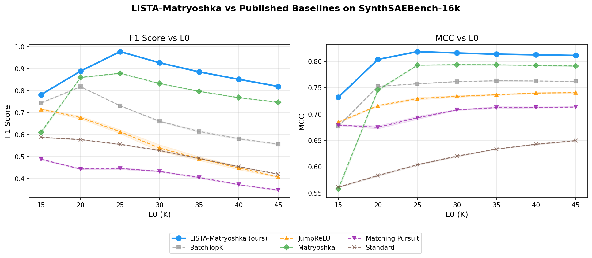

# Letting Claude do Autonomous Research on Improving SAEs

This repository contains the code accompanying the post "Letting Claude do Autonomous Research on Improving SAEs".

We pointed Claude at the [SynthSAEBench-16k](https://decoderesearch.github.io/SAELens/latest/synth_sae_bench/) synthetic SAE benchmark, told it to improve SAE performance (see [TASK.md](TASK.md)), and left it running in a [Ralph Wiggum loop](https://awesomeclaude.ai/ralph-wiggum). By the next morning it had boosted F1 score from 0.88 to 0.95, and within another day — with occasional hints from us — it matched the logistic regression probe ceiling of **0.97 F1**.

The SAE architecture that resulted is in the [autoresearch](autoresearch/) directory along with tests written by Claude, and (one version) of the original task specification is in [TASK.md](TASK.md). We ran claude code with the simple prompt "Follow the instructions in TASK.md."

## Results



The LISTA-Matryoshka SAE that resulted from this Claude-driven autoresearch substantially outperforms all published baselines (BatchTopK, JumpReLU, Standard, Matryoshka, MatryoshkaTopK) on both F1 score and MCC across L0 values on SynthSAEBench-16k.

It's still not clear if this will work for LLM SAEs, but it did an amazing job at the task we set out for it!

## Architecture

The final architecture is a **LISTA-Matryoshka SAE with Decreasing K**, combining several improvements Claude discovered or refined:

| Improvement                         | Description                                                                                                                                                                      |
| ----------------------------------- | -------------------------------------------------------------------------------------------------------------------------------------------------------------------------------- |
| **LISTA encoder**                   | A single iteration of [LISTA](https://icml.cc/Conferences/2010/papers/449.pdf) (neural approximation to sparse coding) as the SAE encoder. Claude found this paper autonomously. |
| **Linearly decrease K**             | Anneal K from a higher initial value down to the target during training.                                                                                                         |
| **Detach inner Matryoshka levels**  | Detach gradients between Matryoshka levels except the outermost.                                                                                                                 |
| **TERM loss**                       | [Tilted ERM](https://arxiv.org/abs/2411.00743) to up-weight high-loss samples (tilt ~2e-3). Also found by Claude.                                                                |
| **Dynamic Matryoshka by frequency** | Sort latents by firing frequency before applying Matryoshka losses.                                                                                                              |

## Repository structure

```
├── autoresearch/
│   ├── sae.py       # LISTA-Matryoshka SAE implementation (training + inference)
│   └── train.py     # Training script with predefined experiments and ablations
├── tests/
│   └── test_sae.py  # Test suite (~40 tests)
├── assets/          # Result plots
├── TASK.md          # Task specification used to guide Claude's research sprints
├── main.py          # Entry point
└── pyproject.toml   # Project config (requires sae-lens>=6.37.6)
```

## Usage

Install dependencies:

```bash
uv sync
```

Run the default LISTA-Matryoshka recipe:

```bash
python autoresearch/train.py default
```

Run ablations (removes one component at a time):

```bash
python autoresearch/train.py ablations
```

Run an L0 sweep:

```bash
python autoresearch/train.py l0_sweep
```

Run tests:

```bash
uv run pytest tests/
```

## Links

- [SynthSAEBench paper](https://arxiv.org/abs/2602.14687)
- [SynthSAEBench docs](https://decoderesearch.github.io/SAELens/latest/synth_sae_bench/)
